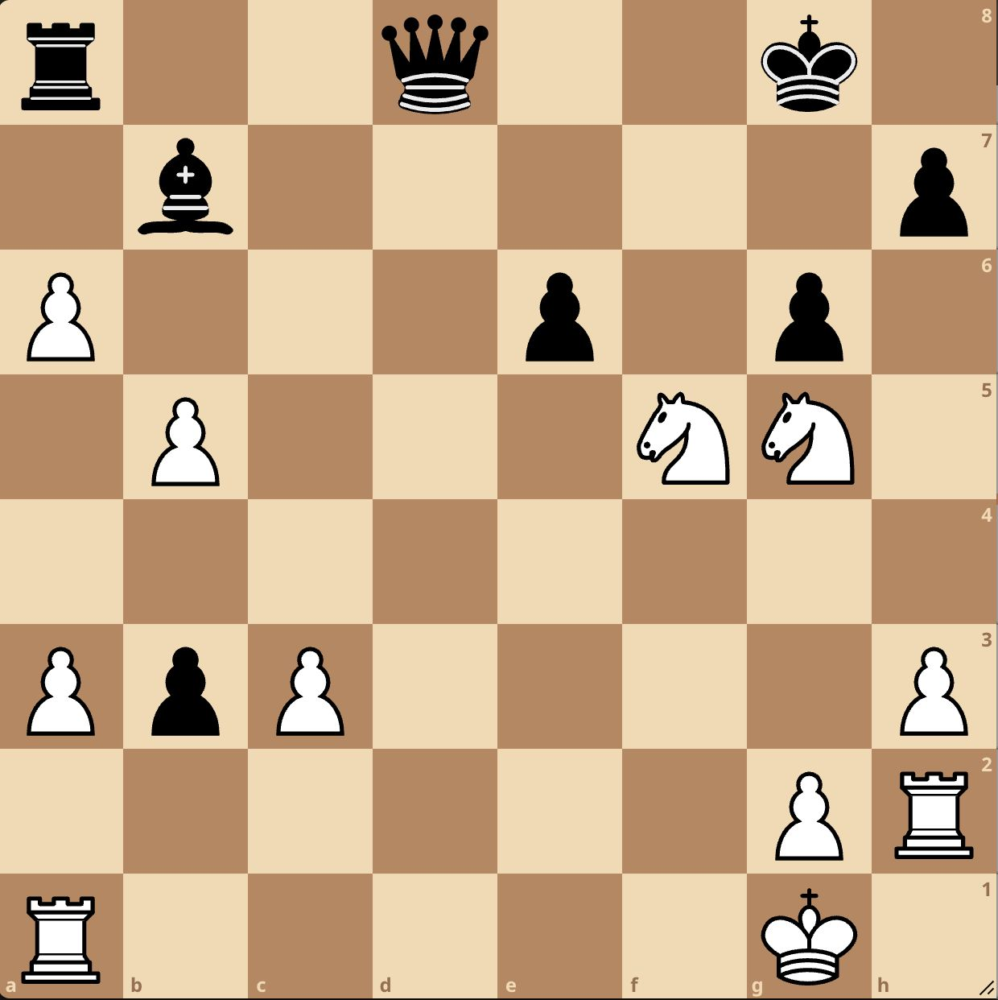

# Chess Puzzle Generation

Generating hard, counter-intuitive chess puzzles using a 134M autoregressive transformer trained with a three-stage pipeline: pretraining on chess positions, supervised fine-tuning on high-rated Lichess puzzles, and reinforcement learning (PPO) with Stockfish-based rewards.

*White to play and win — puzzle generated via our model*
